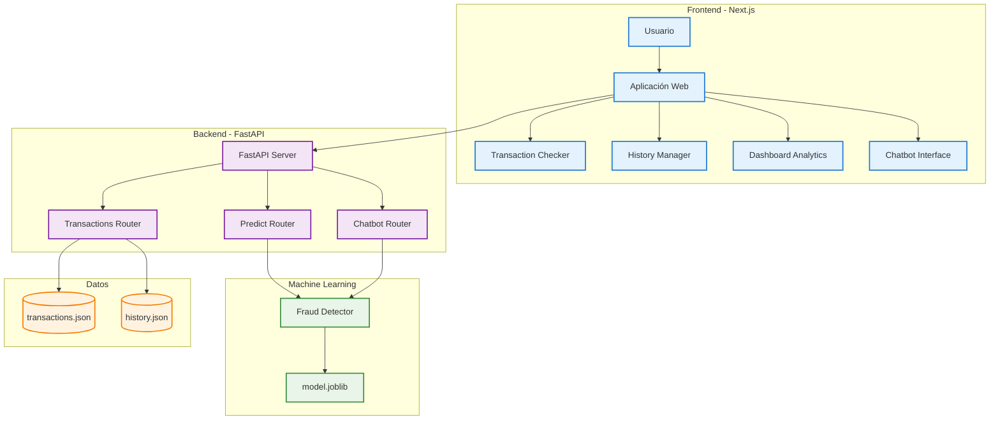

# 🛡️ FraudShield AI

**Sistema Inteligente de Detección de Fraude en Tiempo Real**

FraudShield AI es una plataforma avanzada que utiliza inteligencia artificial para detectar y prevenir fraudes en transacciones financieras en tiempo real. Combina algoritmos de machine learning con una interfaz web intuitiva para proporcionar análisis inmediatos de riesgo y protección proactiva contra actividades fraudulentas.


---

## Objetivos del Proyecto

### **Objetivo Principal**
Desarrollar un sistema integral de detección de fraude que permita a las instituciones financieras identificar transacciones sospechosas con alta precisión y en tiempo real, reduciendo las pérdidas por fraude mientras mantiene una experiencia fluida para usuarios legítimos.

### **Objetivos Específicos**

- **🔍 Detección Inteligente**: Implementar algoritmos de machine learning para identificar patrones fraudulentos con alta precisión
- **⚡ Análisis en Tiempo Real**: Procesar y evaluar transacciones en milisegundos para decisiones inmediatas
- **📊 Dashboard Analítico**: Proporcionar visualizaciones comprensibles del rendimiento del modelo y tendencias de fraude
- **🔗 Integración Simplificada**: Ofrecer APIs RESTful fáciles de integrar con sistemas existentes
- **🛡️ Escalabilidad**: Arquitectura diseñada para manejar volúmenes masivos de transacciones
- **📱 Interfaz Intuitiva**: Aplicación web moderna y responsiva para gestión y monitoreo

---

## Características Principales

### **🤖 Motor de IA**
- Modelo de machine learning entrenado con algoritmos avanzados (Random Forest, Gradient Boosting)
- Análisis multifactorial incluyendo monto, ubicación, dispositivo y patrones comportamentales
- Puntuación de riesgo en escala 0-100 con clasificación automática (LOW/MEDIUM/HIGH/CRITICAL)
- Capacidad de auto-aprendizaje y mejora continua del modelo

### **🌐 API RESTful Completa**
- **Predicción de Fraude**: `POST /api/v1/predict` - Análisis inmediato de transacciones
- **Gestión de Transacciones**: CRUD completo con paginación y filtros avanzados
- **Chatbot Inteligente**: Asistente virtual para consultas y soporte
- **Documentación Interactiva**: Swagger UI integrado en `/docs`

### **💻 Interfaz Web Moderna**
- **Dashboard de Monitoreo**: Visualización en tiempo real de métricas de fraude
- **Verificador de Transacciones**: Interfaz intuitiva para análisis manual
- **Historial Completo**: Registro detallado con búsqueda y filtros
- **Analytics Avanzados**: Gráficos de tendencias, matriz de confusión y KPIs

### **🔧 Arquitectura Robusta**
- **Backend**: FastAPI con Python 3.11+ para máximo rendimiento
- **Frontend**: Next.js 14 con TypeScript para desarrollo type-safe
- **Base de Datos**: Soporte para PostgreSQL (producción) y JSON (desarrollo)
- **Containerización**: Docker y Docker Compose para deployment simplificado

---

## Arquitectura del Sistema



### **Flujo de Procesamiento**

1. **Captura de Datos**: El usuario ingresa información de la transacción
2. **Validación**: El frontend valida y estructura los datos
3. **Análisis ML**: El backend procesa los datos a través del modelo de IA
4. **Scoring**: Se calcula el riesgo y se asigna una clasificación
5. **Respuesta**: Se retorna el resultado con detalles del análisis
6. **Visualización**: El frontend presenta los resultados de forma comprensible

---

## 🚀 Inicio Rápido

### **Prerequisitos**
- Docker y Docker Compose
- Node.js 18+ (para desarrollo local)
- Python 3.11+ (para desarrollo local)

### **Opción 1: Docker (Recomendado)**
```bash
# Clona el repositorio
git clone https://github.com/tu-usuario/fraudshield-ai.git
cd fraudshield-ai

# Inicia todos los servicios
docker-compose up -d

# Verifica que esté funcionando
curl http://localhost:8000/health  # Backend health check
curl http://localhost:3000         # Frontend
```

### **Opción 2: Desarrollo Local**

#### Backend
```bash
# Navega al directorio del backend
cd backend

# Crea y activa el entorno virtual
python -m venv env
# Windows:
env\Scripts\activate
# Linux/macOS:
source env/bin/activate

# Instala las dependencias
pip install -r requirements.txt

# Inicia el servidor de desarrollo
uvicorn app.main:app --reload --host 0.0.0.0 --port 8000
```

#### Frontend
```bash
# Navega al directorio del frontend
cd frontend

# Instala las dependencias
npm install
# o si prefieres pnpm:
pnpm install

# Inicia el servidor de desarrollo
npm run dev
# o:
pnpm dev
```

### **Verificación de Funcionamiento**

Una vez iniciado, verifica que todo funcione correctamente:

- **Backend API**: http://localhost:8000
- **Documentación Swagger**: http://localhost:8000/docs
- **Frontend**: http://localhost:3000
- **Health Check**: http://localhost:8000/health

---

## 📚 Documentación de la API

### **Endpoints Principales**

#### **🔍 Predicción de Fraude**
```http
POST /api/v1/predict
Content-Type: application/json

{
  "amount": 150.00,
  "location": "USA",
  "device": "mobile",
  "merchant_category": "restaurant",
  "transaction_hour": 14
}
```

**Respuesta:**
```json
{
  "transaction_id": "txn_123456789",
  "is_fraud": false,
  "fraud_probability": 0.23,
  "risk_score": 23,
  "risk_level": "LOW",
  "confidence": 0.77,
  "factors": {
    "amount_risk": "low",
    "location_risk": "low",
    "device_risk": "medium"
  },
  "timestamp": "2025-12-18T10:30:00Z"
}
```

#### **📊 Gestión de Transacciones**
```http
GET /api/v1/transactions?page=1&size=10&risk_level=HIGH
POST /api/v1/transactions
GET /api/v1/transactions/{id}
PUT /api/v1/transactions/{id}
DELETE /api/v1/transactions/{id}
```

#### **🤖 Chatbot Inteligente**
```http
POST /api/v1/chat
Content-Type: application/json

{
  "message": "¿Cuáles son los factores de riesgo más comunes?",
  "context": "fraud_analysis"
}
```

---

## 🛠️ Estructura del Proyecto

```
FraudShieldAI/
├── 📁 backend/                    # API y lógica de negocio
│   ├── 📁 app/
│   │   ├── 📄 main.py            # Aplicación FastAPI principal
│   │   ├── 📁 routers/           # Endpoints organizados
│   │   │   ├── 📄 predict.py     # Predicción de fraude
│   │   │   ├── 📄 transactions.py # CRUD transacciones
│   │   │   └── 📄 chatbot.py     # Asistente virtual
│   │   ├── 📁 ml/                # Motor de Machine Learning
│   │   │   ├── 📄 fraud_detector.py
│   │   │   ├── 📄 model.joblib   # Modelo entrenado
│   │   │   └── 📄 train_model.py
│   │   ├── 📁 schemas/           # Modelos Pydantic
│   │   └── 📁 models/            # Modelos de datos
│   ├── 📄 requirements.txt       # Dependencias Python
│   └── 🐳 Dockerfile            # Container backend
│
├── 📁 frontend/                   # Interfaz web moderna
│   ├── 📁 app/                   # Next.js App Router
│   │   ├── 📄 page.tsx           # Página principal
│   │   ├── 📁 check/             # Verificador de transacciones
│   │   ├── 📁 history/           # Historial completo
│   │   ├── 📁 analytics/         # Dashboard analítico
│   │   └── 📁 chat/              # Chatbot interface
│   ├── 📁 components/            # Componentes React reutilizables
│   │   ├── 📁 checker/           # UI verificación
│   │   ├── 📁 history/           # UI historial
│   │   ├── 📁 analytics/         # UI métricas
│   │   ├── 📁 chatbot/           # UI conversacional
│   │   └── 📁 ui/                # Componentes base
│   ├── 📁 lib/                   # Utilidades y API client
│   │   ├── 📄 api.ts             # Cliente HTTP
│   │   └── 📄 types.ts           # Tipos TypeScript
│   ├── 📄 package.json           # Dependencias Node.js
│   └── 🐳 Dockerfile            # Container frontend
│
├── 📁 data/                      # Datos de desarrollo
│   ├── 📄 transactions.json      # Datos de ejemplo
│   └── 📄 history.json          # Historial mock
│
├── 📁 docs/                      # Documentación adicional
│   ├── 📄 QUICK_START.md
│   ├── 📄 INTEGRATION_GUIDE.md
│   └── 📄 API_REFERENCE.md
│
├── 🐳 docker-compose.yml        # Orquestación de servicios
├── 📄 ARCHITECTURE.md           # Documentación arquitectura
└── 📄 README.md                 # Este archivo
```

---

## 📸 Screenshots

### Dashboard Principal


### Verificador de Transacciones


### Analytics y Métricas


### Historial de Transacciones


---

## 🧪 Casos de Uso

### **Caso 1: Verificación de Transacción Sospechosa**
Un banco detecta una transacción de $5,000 desde un dispositivo nuevo en una ubicación inusual. FraudShield AI:
- Analiza el monto vs. historial del usuario
- Evalúa el riesgo geográfico
- Considera el patrón de dispositivos
- **Resultado**: Risk Score 85 (HIGH) - Requiere verificación adicional

### **Caso 2: Transacción Legítima**
Un usuario realiza una compra rutinaria de $50 en su tienda habitual:
- Monto dentro del rango normal
- Ubicación familiar
- Dispositivo reconocido
- **Resultado**: Risk Score 15 (LOW) - Aprobación automática

### **Caso 3: Análisis de Tendencias**
El departamento de fraude necesita entender patrones semanales:
- Dashboard muestra picos en fines de semana
- Identifica categorías de alto riesgo
- Genera reportes automatizados
- **Resultado**: Optimización de reglas de detección

---

---

## 🧠 Modelo de Machine Learning

### **Características del Modelo**
- **Algoritmo**: Ensemble de Random Forest y Gradient Boosting
- **Features**: 15+ características incluyendo monto, ubicación, tiempo, patrones comportamentales
- **Precisión**: >95% en conjunto de prueba
- **Falsos Positivos**: <2% optimizado para experiencia del usuario

### **Features Utilizadas**
| Feature | Descripción | Importancia |
|---------|-------------|-------------|
| `amount` | Monto de la transacción | Alta |
| `location` | País/región de origen | Alta |
| `device_type` | Tipo de dispositivo | Media |
| `merchant_category` | Categoría del comercio | Media |
| `transaction_hour` | Hora de la transacción | Media |
| `days_since_last` | Días desde última transacción | Baja |

### **Entrenamiento del Modelo**
```bash
cd backend/app/ml
python train_model.py --data-path ../data/training_data.csv --save-model model.joblib
```


---

## 🐛 Troubleshooting

### **Problemas Comunes**

#### Puerto en Uso
```bash
# Windows
netstat -ano | findstr :8000
taskkill /PID <PID> /F

# Linux/macOS
lsof -ti:8000 | xargs kill -9
```

#### Problemas de CORS
```python
# Verificar configuración en backend/app/main.py
allow_origins=["http://localhost:3000"]
```

#### Modelo ML No Carga
```bash
# Verificar que el archivo existe
ls -la backend/app/ml/model.joblib

# Re-entrenar si es necesario
python backend/app/ml/train_model.py
```

---

## 🤝 Soporte

### **Documentación Adicional**
- 📖 [Guía de Inicio Rápido](docs/QUICK_START.md)
- 🏗️ [Documentación de Arquitectura](ARCHITECTURE.md)
- 🔧 [Guía de Configuración](docs/CONFIGURATION.md)
- 📚 [Referencia de API](docs/API_REFERENCE.md)

### **Contacto**
- 📧 Email: support@fraudshieldai.com
- 💬 Discord: [FraudShield Community](https://discord.gg/fraudshield)
- 📱 Issues: [GitHub Issues](https://github.com/tu-usuario/fraudshield-ai/issues)

---

<div align="center">

**🛡️ FraudShield AI - Protegiendo el futuro de las transacciones financieras**

[](https://github.com/tu-usuario/fraudshield-ai/stargazers)
[](https://github.com/tu-usuario/fraudshield-ai/network/members)
[](https://github.com/tu-usuario/fraudshield-ai/issues)

*Construido con ❤️ por el equipo de FraudShield AI*

</div>
```
